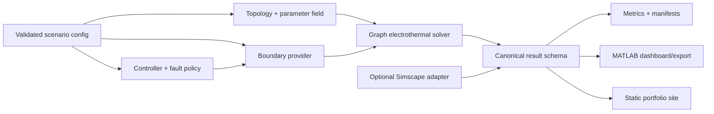

# ThermoWeave Architecture and Interface Contracts

## System view



The core is dependency-inverted around plain MATLAB structures. Boundary providers and controllers are evaluated by the solver but never reach into its internal state. Every downstream consumer receives the same canonical result structure.

## Package responsibilities

| Package | Responsibility |
|---|---|
| `thermoweave.config` | Load JSON, apply defaults, validate dimensions/ranges/units |
| `thermoweave.electrical` | SOC evolution and synthetic heat-generation model |
| `thermoweave.thermal` | Layout, adjacency, graph conductance, ODE integration |
| `thermoweave.coolant` | Prescribed and coolant-marching boundary fields |
| `thermoweave.control` | Bounded/rate-limited baseline and optional advanced policy |
| `thermoweave.uncertainty` | Seeded parameter dispersion and declared faults |
| `thermoweave.results` | Metrics, manifests, hashes, canonical schema |
| `thermoweave.visualization` | Dashboard and deterministic exports only through results |
| `thermoweave.util` | Product detection, hashing, paths, small shared validation |

## Configuration contract

Configuration is a scalar structure produced by `thermoweave.config.loadScenario(pathOrStruct)`. Temperatures use kelvin internally; time seconds; current amperes; capacity ampere-hours; thermal capacity joules per kelvin; conductance watts per kelvin; mass flow kilograms per second; coolant heat capacity joules per kilogram-kelvin.

Required top-level fields are `schemaVersion`, `scenario`, `simulation`, `layout`, `cell`, `thermal`, `electrical`, `boundary`, `controller`, `variability`, `faults`, and `metrics`. Cell-indexed arrays are canonical **N-by-1 columns** ordered by layout node ID. Validation rejects implicit broadcasting except explicitly documented scalar expansion.

## Topology contract

`thermoweave.thermal.buildTopology(config.layout)` returns:

- `nodeId`: N-by-1 integer column, exactly `1:N`;
- `row`, `column`, `x_m`, `y_m`: N-by-1 columns;
- `edges`: M-by-2 unique, ascending node pairs;
- `edgeConductance_W_per_K`: M-by-1 positive column;
- `zoneId`: N-by-1 positive integer column;
- `channelOrder`: a permutation of `1:N`.

Rectangular layouts use orthogonal nearest neighbours. Staggered layouts offset alternating rows and use a distance threshold derived from pitch; neither layout hard-codes cell indices.

## Runtime model contract

The state is `y = [temperature_K; soc]`, a 2N-by-1 column. The derivative evaluates a boundary structure containing `temperature_K`, `conductance_W_per_K`, `mode`, `zoneCommand`, and optional coolant diagnostics. Heat flow is positive **into** a cell. Stored thermal energy change is compared with generated heat minus exported graph/boundary/coolant heat using the same flux definitions as the ODE.

## Controller contract

Controller input contains sensed N-by-1 temperature, reference temperature, prior zone command, elapsed step, and fault metadata. Output is a Z-by-1 command in `[0,1]`. The baseline implementation must clamp magnitudes and rates. An advanced result must report product availability, solver status, objective weights, and fallback usage.

## Canonical result schema (`thermoweave.result/v1`)

```text
schemaVersion
time_s                  Nt x 1
state.temperature_K     Nt x N
state.soc               Nt x N
boundary.temperature_K  Nt x N
boundary.conductance_W_per_K Nt x N
control.zoneCommand     Nt x Z
signals.current_A       Nt x 1
signals.heatGeneration_W Nt x N
signals.coolingPowerProxy_W Nt x 1
metrics                 scalar structure
topology                topology contract
configuration           fully resolved configuration
metadata                release/products/seed/solver/tolerances/hash/git/time
events                  declared disturbances, faults, fallbacks, skips
```

JSON exports may down-sample arrays but must preserve summary values and the source manifest hash. Site code may display only values present in the export.

## Optional Simscape boundary

`simscape/` owns product detection, reproducible model/library generation, execution through `Simulink.SimulationInput`, and mapping into the canonical result schema. Generated libraries, `slprj`, caches, and logs are not tracked. Structural generation remains gated until the repository's custom-library policy is explicitly resolved.

## Failure semantics

Public functions use identifiers rooted at `thermoweave:`. Invalid user configuration is an error. An unavailable optional product creates an explicit skip record, never a fabricated simulation. Controller optimization failure emits a fallback event and uses the bounded baseline policy.
