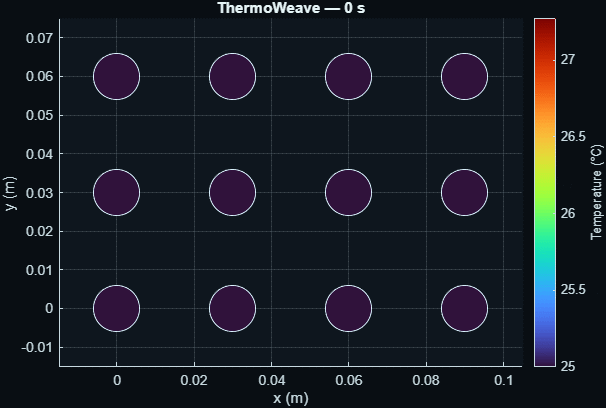
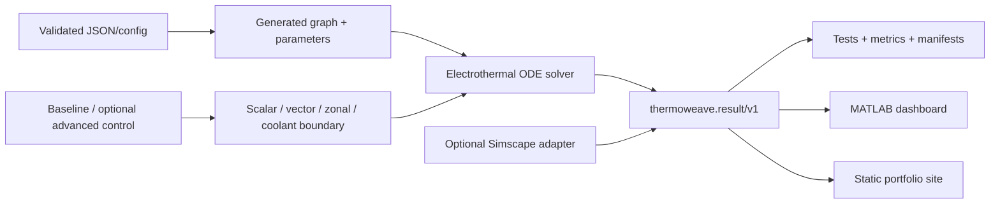

# ThermoWeave

> Adaptive spatial electrothermal digital twin for battery cooling design


ThermoWeave is an independent MATLAB implementation for exploring how spatially and temporally varying cooling boundaries affect a synthetic multi-cell assembly. Its portable graph core runs without Simscape Battery; an optional adapter is kept behind explicit product, library-policy, and generated-model gates.



The screenshot above is generated by `tools/generateArtifacts.m` from the canonical result structure. Default local demo evidence on MATLAB R2026a Update 4: peak temperature **298.230683 K**, normalized energy-accounting residual approximately **4.39e-15**. These values describe a synthetic demonstration, not real-cell predictive accuracy.

## Why this exists

A pack-average temperature can conceal the boundary gradients, coolant warming, contact dispersion, and local faults that shape cooling decisions. ThermoWeave makes those spatial effects inspectable in a small model whose equations, units, topology, solver settings, controller constraints, random seeds, and limitations are source controlled.

## Distinct engineering contributions

- configuration-generated rectangular and staggered thermal graphs;
- one solver interface for scalar, per-cell vector, zonal, and finite-capacity coolant-propagation boundaries;
- transparent Joule plus optional signed entropic heat with SOC evolution;
- deterministic bounded/rate-limited zonal control and an observable optimization fallback;
- seeded variability and fault events covering resistance/contact dispersion, restriction or pump loss, sensor bias/dropout, elevated heat, current imbalance, and stuck actuators;
- a canonical `thermoweave.result/v1` schema shared by tests, MATLAB UI, artifacts, and the data-driven website;
- explicit optional Simscape skip semantics rather than a fabricated integration claim.

## Architecture



The cell energy balance is

$$
C_i\dot T_i = Q_{\mathrm{gen},i}
- \sum_j G_{ij}(T_i-T_j)
- G_{b,i}(T_i-T_{b,i})
- G_{c,i}(T_i-T_{c,i}).
$$

Temperatures are kelvin internally, current is positive on discharge, and heat flow is positive into a cell. The complete derivation, coolant balance, controller objective, units, and limitations are in [`docs/model.md`](docs/model.md).

## Quick start

Requires MATLAB R2024a or newer for the core.

```matlab
startup
result = runDemo;
thermoweave.visualization.dashboard(result)
```

Run the mandatory suite and generate the same lightweight artifacts used by this README and the website:

```matlab
buildtool test
generateArtifacts
```

## Product matrix

| Capability | Requirement | Current local evidence |
|---|---|---|
| Graph core, baseline control, scenarios, JSON export | MATLAB R2024a+ | Tested on R2026a Update 4 |
| Build reports and enhanced coverage | MATLAB Test where available | Installed and exercised locally |
| Advanced quadratic controller | Optimization Toolbox | Installed; transparent fallback retained |
| MPC-specific extension | Model Predictive Control Toolbox | Installed; not required by the portable core |
| High-fidelity adapter | Simulink + Simscape + Simscape Battery | Products installed; structural generation policy-gated |
| Static case-study page | Modern browser | Source built; not deployed |

## Experiments and examples

The predeclared E0–E9 matrix is in [`docs/scenarios.md`](docs/scenarios.md). Four direct entry points are included:

```matlab
compareBoundaryModes
runAdaptiveCooling
runMonteCarloStudy(20)
compareCoreAndSimscape
```

The generated website bundle includes actual scalar, vector, zonal, coolant-restriction, and sensor-fault result records under `artifacts/web-data/`. Every displayed metric is read from that exported JSON and is tied to a scenario hash.

## Testing and CI

The local class-based test suite passed **31/31**, with 0 failed and 0 incomplete. It covers strict configuration failure modes, equilibrium, relaxation, energy accounting and solver convergence, uniform scalar/vector equivalence, graph relabelling, coolant conservation and flow reversal, fault targeting, per-segment conductance, baseline/advanced controller bounds and a predeclared synthetic benefit, multi-interface variability, deterministic result export, schema mapping, and honest Simscape status.

```matlab
results = runtests("tests", IncludeSubfolders=true)
buildtool
```

Core CI uses official MATLAB Actions on R2024a. Full Simscape integration is manual and targets a licensed self-hosted runner labelled `thermoweave-simscape`. CI and Pages badges deliberately remain “not deployed” until a remote run exists. See [`docs/validation.md`](docs/validation.md).

## Repository map

```text
config/                 Reproducible JSON scenarios
src/+thermoweave/       Portable package implementation
simscape/               Optional product- and policy-aware adapter
examples/               Boundary, control, Monte Carlo, adapter workflows
tests/                  Unit, integration, and regression tests
artifacts/              Lightweight generated figures, manifests, web data
docs/                   Technical docs and animated static case study
tools/                  Artifact, documentation, and release entry points
.github/workflows/      Core, integration, Pages, and release automation
```

## Limitations and safety

ThermoWeave is a lumped reduced-order demonstrator with synthetic parameters. It does not model detailed electrochemistry, ageing, phase change, runaway chemistry, or certified safety functions. It is not a design approval tool, production controller, or substitute for test data. Controller benefits are scenario-specific. No measured held-out validation has been performed.

## Inspiration and related documentation

The project is an **independent implementation inspired by documented scalar/vectorized thermal-boundary concepts** in MathWorks, [“Add Vectorized and Scalar Thermal Boundary Conditions to Battery Models”](https://www.mathworks.com/help/simscape-battery/ug/battery-thermal-boundary-conditions-vectorized-scalar-example.html). No source code, prose, diagrams, screenshots, numerical scenarios, page structure, or example-specific names were copied. MathWorks did not sponsor or endorse ThermoWeave. See [`PROVENANCE.md`](PROVENANCE.md) and [`THIRD_PARTY_NOTICES.md`](THIRD_PARTY_NOTICES.md).

## Citation, contribution, and roadmap

Citation metadata is in [`CITATION.cff`](CITATION.cff). Contributions should follow [`CONTRIBUTING.md`](CONTRIBUTING.md), the security policy in [`SECURITY.md`](SECURITY.md), and the evidence rules in the project charter. Planned work is recorded in [`ROADMAP.md`](ROADMAP.md).
