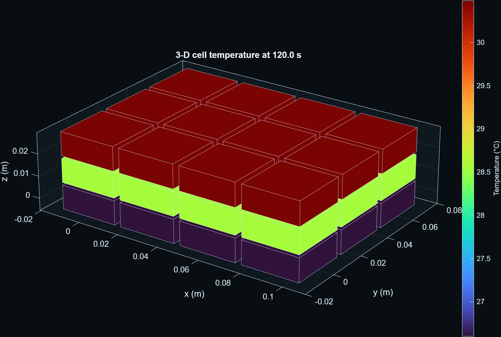
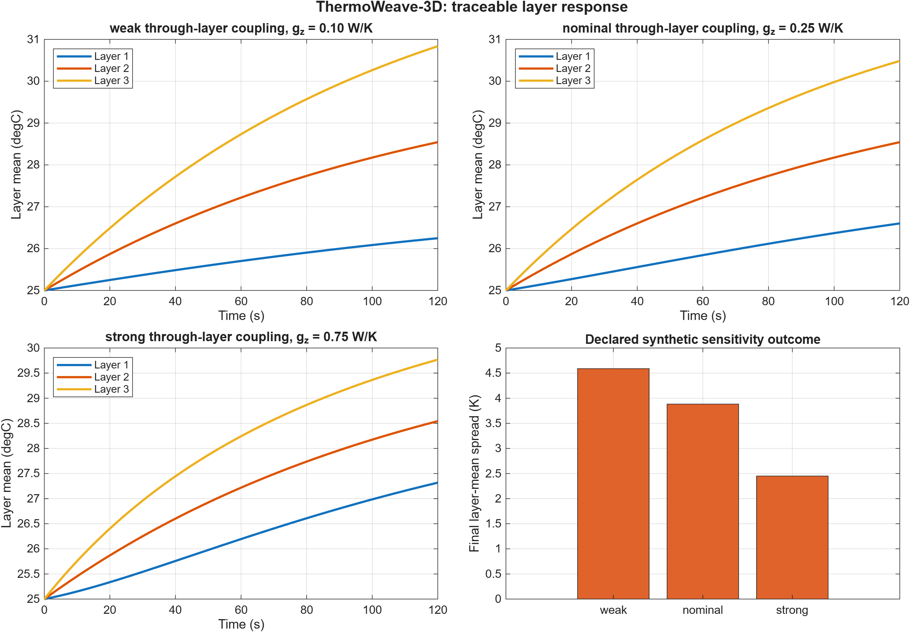

# ThermoWeave-3D: A deterministic Cartesian graph electrothermal model for layer-resolved battery-module studies

**Mohammad Rezwan Khan**<br>
Affiliation and corresponding-author details: **to be confirmed by the author before submission**

**Manuscript type:** Methods and research-software article<br>
**Version:** 0.2.0-draft (14 August 2026)<br>
**Status:** Journal-formatted preprint draft; not peer reviewed and not validated against physical-cell measurements

## Abstract

Spatial temperature differences in battery modules motivate models that retain inter-cell heat exchange without requiring a full computational-fluid-dynamics or finite-element workflow for every controls and sensitivity study. This paper presents ThermoWeave-3D, an independently implemented MATLAB research model that represents an electrothermal module as a deterministic Cartesian graph. Each node stores temperature and state of charge, axis-aligned edges carry independently declared thermal conductances, and explicit masks identify the six exterior faces. The implementation extends an earlier two-dimensional graph core while preserving the original one-layer result contract. A canonical 3-by-4-by-3 synthetic case contains 36 nodes and 75 thermal interfaces. Verification includes graph counts, Laplacian symmetry and positive semidefiniteness, internal-flux conservation, one-layer reduction, isothermal invariance, result-schema dimensions, deterministic configuration hashes, and headless three-dimensional rendering. A controlled through-layer sensitivity study varies the declared z-axis conductance from 0.10 to 0.75 W/K under the same imposed layer boundary field. In this constructed case, the final layer-mean temperature spread decreases from 4.589 K to 2.450 K, while normalized instantaneous energy-accounting residuals remain between 6.74e-14 and 1.08e-13. These numbers verify implementation behavior for disclosed assumptions; they are not predictive-accuracy claims. ThermoWeave-3D contributes an inspectable topology contract, reproducible evidence pipeline, and shared numerical/visual data source. Measured-data or independently solved three-dimensional validation remains required before the model can support cell-design, safety, or control-certification claims.

**Keywords:** battery thermal model; graph Laplacian; electrothermal simulation; inter-cell heat exchange; reduced-order model; reproducible research; MATLAB

## 1. Introduction

Battery heat generation, heat transport, and temperature nonuniformity affect efficiency, ageing, performance, and safety, although the appropriate model fidelity depends on the engineering question [1-3]. Lumped resistance-capacitance models are attractive for controls and system studies because their states and parameters remain interpretable [4,5]. Module-scale thermal equivalent circuits demonstrate that networks can represent cooling and inter-cell exchange at much lower cost than high-fidelity spatial solvers [6]. At the same time, measurements and inverse studies show that directional thermal transport can be important for cylindrical and pouch cells [7-9]. Spatially resolved reduced-order models therefore occupy a useful middle ground between a single average temperature and a detailed multiphysics field solution [10].

Commercial engineering tools also expose inter-cell thermal paths between neighbouring cell thermal nodes [14,15]. Those public documentation pages establish high-level prior art for thermal networks and per-connection thermal resistance. ThermoWeave-3D does not copy their source code, prose, equations, diagrams, screenshots, example topology, parameter values, object names, model hierarchy, or numerical scenarios. Its graph API, node ordering, six-face masks, verification tests, scenario, figures, and manuscript were developed independently. The transferable scientific ideas are the conservation of energy and the ordinary thermal-resistance analogy.

The practical research gap addressed here is not a new heat equation. It is an inspectable, configuration-generated three-dimensional graph that (i) separates conductances by Cartesian direction, (ii) preserves deterministic node and edge identities, (iii) exposes all exterior faces without embedding a particular cooling technology, (iv) emits one canonical result structure for tests, figures, and data export, and (v) reduces exactly to the established two-dimensional topology when the layer count is one.

The contributions of this work are:

1. a deterministic cuboid and stacked-staggered topology contract with three-dimensional coordinates, axis-labelled interfaces, six-face masks, and anisotropic conductance parameters;
2. a backward-compatible extension of an electrothermal graph ODE and canonical result schema;
3. manufactured and structural verification tests covering graph physics, reduction, conservation, determinism, and visualization; and
4. a traceable sensitivity study whose CSV, JSON, figures, scenario hashes, source, and environment metadata are generated from the same simulation results.

The contribution is best understood as a research-software and methods result. No claim is made that graph thermal networks, anisotropic conduction, or inter-cell heat exchange are themselves novel. No measured held-out dataset is used, so no real-cell accuracy or safety claim is made.

## 2. Related work and positioning

Bernardi et al. derived a general battery energy balance separating irreversible and reversible heat contributions [1]. Reviews by Bandhauer et al. and Rao and Wang place those sources in the wider context of lithium-ion thermal behavior and management [2,3]. Forgez et al. and Lin et al. demonstrated identifiable lumped cell models, including core/surface descriptions [4,5]. Gan et al. used a thermal equivalent-circuit model for a heat-pipe-cooled cylindrical-cell module, illustrating the usefulness of network representations at module scale [6].

Directional transport is supported by experimental and inverse evidence. Drake et al. measured anisotropic thermophysical properties of cylindrical cells [7]. Lin et al. characterized anisotropic thermal behavior in large-format pouch cells [8], and Al-Zareer et al. estimated anisotropic properties and distributed heat generation using inverse heat transfer [9]. Richardson et al. retained a two-dimensional temperature field in a low-order spectral-Galerkin formulation [10]. ThermoWeave-3D selects a different discretization: ordinary graph nodes and axis-aligned weighted edges. This choice favors transparency and configuration-level traceability over within-cell field resolution.

Reproducibility is treated as part of the method. FAIR principles motivate findable, accessible, interoperable, and reusable digital research objects [11]. Sandve et al. and Taschuk and Wilson emphasize retained inputs, version control, automation, and robust research software practices [12,13]. ThermoWeave-3D accordingly records resolved configurations, random seeds, solver settings, environment metadata, scenario hashes, canonical array orientation, and generated-artifact manifests. These practices improve auditability but do not substitute for physical validation.

## 3. Model and implementation

### 3.1 States and sign conventions

The module contains N lumped nodes. Node i has temperature T_i in kelvin and state of charge z_i in [0,1]. The solver state is y = [T; z]. Positive current denotes discharge, and positive heat flow is directed into a node. Histories are stored as N_t-by-N arrays so every output row contains the complete spatial state at one time.

### 3.2 Weighted graph energy balance

Let B be an E-by-N oriented incidence matrix with one +1 and one -1 per edge, and let g contain positive edge conductances in W/K. The weighted graph Laplacian is

> L_g = B^T diag(g) B.                                                     (1)

With diagonal thermal-capacity matrix C, ambient boundary conductance H_a, boundary temperature T_a, generated heat q_gen, optional cooling heat q_cool, and external heat q_ext, the solid balance is

> C dT/dt = -L_g T - H_a(T - T_a) + q_gen + q_cool + q_ext.                (2)

Every internal edge contributes equal and opposite heat to its two endpoint nodes. Consequently, 1^T L_g T = 0 for every T. The implemented Laplacian is symmetric positive semidefinite when every g_e is positive.

Irreversible Joule heating is

> q_J,i = I_i^2 R_i(T_i,z_i),                                             (3)

with a documented synthetic resistance law and an optional signed entropic term based on -I_i T_i (partial U_oc/partial T)_i. Coulomb-counted SOC uses declared charge and discharge efficiencies. The present study disables entropic heat and uses a constant 8 A discharge per node.

### 3.3 Deterministic three-dimensional topology

For row r, column c, and layer l in an n_r-by-n_c-by-n_l cuboid, node identity is

> i = r + (c-1)n_r + (l-1)n_r n_c.                                       (4)

Coordinates are ((c-1)p_x, (r-1)p_y, (l-1)p_z), where p_x, p_y, and p_z are declared pitches. Nearest-neighbour interfaces are generated in x, y, and z. Their conductances are g_x, g_y, and g_z, respectively. The model serializes the edge endpoints, edge-axis label, conductance, incidence matrix, Laplacian, coordinates, grid size, and Boolean x-min, x-max, y-min, y-max, z-min, and z-max masks.

For a cuboid, the expected number of edges is

> E = n_r(n_c-1)n_l + (n_r-1)n_c n_l + n_r n_c(n_l-1).                    (5)

The 3-by-4-by-3 case therefore has 36 nodes and 27 + 24 + 24 = 75 interfaces. When n_l = 1, no z interface is generated, z coordinates are zero, and the in-plane node order, edges, conductances, coordinates, and Laplacian match the legacy rectangular topology exactly.

### 3.4 Boundary representation

Boundary temperature and resolved node conductance can be scalar, per-node vector, zonal, or coupled to an algebraically marched coolant. A coefficient in W/(m^2 K) must be converted explicitly to a node conductance in W/K; the core does not guess an area. Six-face masks identify nodes on geometric faces but do not automatically impose a physical boundary. This separation permits independently declared face cooling, insulation, heating, or future reduced-order coupling without changing the topology.

### 3.5 Solver and canonical output

The implementation uses MATLAB adaptive ODE solvers (`ode15s` by default, with `ode45` available for convergence checks). The canonical `thermoweave.result/v1` object contains time, temperature, SOC, boundaries, control, current and heat signals, metrics, topology, resolved configuration, event metadata, solver/product metadata, and a SHA-256 scenario hash. Figures read this result object rather than a separate plotting dataset.

## 4. Verification and study design

### 4.1 Structural and manufactured verification

Six new automated tests were added to the existing suite. They verify:

- the 36-node, 75-edge count and deterministic layer indexing;
- x/y/z edge counts, finite positive conductances, Laplacian symmetry, zero row sum, and nonnegative eigenvalues within numerical tolerance;
- all six exterior-face masks and expected cardinalities;
- exact one-layer reduction to the established two-dimensional rectangular topology;
- canonical 36-node temperature, SOC, and heat histories, finite state, spatial response, and normalized energy residual no larger than 1e-3;
- invariance of a uniform 300 K state in an insulated, zero-current 2-by-2-by-2 manufactured case; and
- headless construction of the three-dimensional patch, axes, color scale, and fixed camera.

The complete MATLAB class suite contains 37 tests. On MATLAB R2026a Update 4 on Windows 11, 37 passed, 0 failed, and 0 were incomplete. This test result establishes the checked software contracts in that environment. It is not a validation of a physical battery.

### 4.2 Synthetic sensitivity case

The canonical configuration uses a 3-by-4-by-3 cuboid, p_x = p_y = 0.03 m, p_z = 0.012 m, g_x = 0.80 W/K, g_y = 0.60 W/K, and nominal g_z = 0.25 W/K. Every node has declared thermal capacity 40.5 J/K, initial temperature 298.15 K, initial SOC 0.8, resistance 0.008 ohm, and current 8 A. The three layers receive imposed boundary temperatures of 298.15, 302.15, and 306.15 K with a resolved boundary conductance of 0.35 W/K per node. Ambient conductance is 0.08 W/K per node. The open-loop simulation duration is 120 s with 2 s output spacing, relative tolerance 1e-7, absolute tolerance 1e-9, and maximum internal step 0.5 s.

Only g_z is varied: 0.10 W/K (weak), 0.25 W/K (nominal), and 0.75 W/K (strong). The source scenario, variation, and full resolved configuration are hashed separately for each case. The primary descriptive quantities are peak temperature, peak edge gradient, final spread of the three layer-mean temperatures, and normalized energy-accounting residual.

## 5. Results

### 5.1 Three-dimensional field

Figure 1 shows the final nominal temperature field. The imposed synthetic layer boundary creates a monotonic through-layer response. The graph visualization uses the same node coordinates and temperature array used by the numerical checks.



**Figure 1.** Final nominal ThermoWeave-3D field at 120 s. Colors show node temperature in degrees Celsius for display; the solver uses kelvin. The geometry is a graph visualization, not a resolved cell solid or fluid domain.

### 5.2 Through-layer conductance sensitivity

Figure 2 and Table 1 summarize the declared g_z sweep.



**Figure 2.** Layer-mean temperature histories and final layer-mean spread for weak, nominal, and strong through-layer coupling under the same synthetic boundary field.

**Table 1. Synthetic sensitivity results.**

| Case | g_z (W/K) | Peak T (K) | Peak edge gradient (K) | Final layer-mean spread (K) | Normalized residual |
|---|---:|---:|---:|---:|---:|
| Weak | 0.10 | 303.9873 | 2.2944 | 4.5889 | 1.08e-13 |
| Nominal | 0.25 | 303.6345 | 1.9416 | 3.8831 | 6.74e-14 |
| Strong | 0.75 | 302.9179 | 1.2251 | 2.4501 | 1.08e-13 |

Under these assumptions, increasing g_z from 0.10 to 0.75 W/K reduces final layer-mean spread by 46.6% and peak temperature by 1.069 K. The result is consistent with stronger equalizing heat exchange between layers. Because the boundary temperatures are prescribed and the parameters are synthetic, this comparison does not establish an optimal design or a transferable battery-performance benefit.

All three residuals are approximately 1e-13, far below the declared 1e-3 integration-test gate. This indicates internally consistent instantaneous flux bookkeeping for these runs. It does not measure discretization error or agreement with a higher-fidelity or physical reference.

## 6. Discussion

The deterministic topology makes several forms of review straightforward. A reviewer can derive node and edge counts from the grid dimensions, examine each axis conductance independently, reproduce the node ordering, and verify boundary selections from face masks. Storing axis labels also supports parameter ablations and future calibration in which in-plane and through-layer interfaces have different priors.

The one-layer reduction is important for fusing the three-dimensional extension with the earlier ThermoWeave work. It avoids a parallel solver or result schema: the same ODE, configuration validator, metrics, export paths, controls, and optional coolant boundary operate on either a two-dimensional or three-dimensional topology. Existing 2-D regression tests remain applicable, while the new tests isolate the added dimension.

The sensitivity study illustrates a physically plausible qualitative consequence of greater through-layer conductance, but it deliberately stops short of calibration. The graph node represents a lumped cell or zone. It does not resolve within-cell gradients, tabs, current collectors, contact-pressure fields, cooling plates, manifolds, radiation view factors, or fluid flow. A detailed finite-element or CFD model could supply interface conductances or a comparison field, as suggested at a high level in the MathWorks workflow documentation [14], but no proprietary or third-party result is used here.

## 7. Limitations and validation roadmap

The most important limitation is the absence of independent measured or high-fidelity validation. Parameters are synthetic software-test assumptions and are not transferable to a named chemistry, format, or module. The electrical model is a transparent resistance/SOC heat source rather than an electrochemical model. Ageing, phase change, gas generation, venting, abuse, and thermal runaway are outside scope. The plotted cuboids communicate graph state; they are not a geometric thermal mesh.

The current evidence is local to MATLAB R2026a Update 4 for the new 3-D tests. The earlier portable core also has a public R2024a CI record, but the new extension must complete that CI path after publication. Optional Simscape integration remains explicitly skipped because the repository's custom-library policy is unresolved; no Simscape agreement is claimed. Statement coverage remains below the project's advisory 80% goal and should be improved before a formal software release.

A scientific validation program should include: (i) manufactured transient cases with analytical solutions where available; (ii) a resolution study against a separately implemented finite-volume or finite-element solution; (iii) calibrated interface conductances with uncertainty intervals; (iv) held-out module measurements with sensor uncertainty and preregistered metrics; (v) solver and time-step sensitivity; and (vi) comparisons across multiple boundary patterns. Until that work is complete, ThermoWeave-3D should be used for methods development and relative synthetic studies only.

## 8. Reproducibility and availability

The study is reproduced from the repository root with:

```matlab
startup
results = runtests("tests", IncludeSubfolders=true)
evidence = generate3DResearchArtifacts()
```

The source scenario is `config/3d-intercell-study.json`. The generated record is `artifacts/reports/3d-study-summary.json`; the compact numeric table is `artifacts/data/3d-study-results.csv`. Figures are `artifacts/figures/3d-module-temperature.png` and `artifacts/figures/3d-layer-response.png`. Each case includes a SHA-256 hash of its resolved configuration. The public source repository and archival identifier should be inserted here after the final revision is committed and, ideally, deposited with a versioned DOI.

## 9. Originality, provenance, and AI-assistance disclosure

Official MathWorks documentation was consulted only for high-level prior-art context on inter-cell thermal paths and battery-module heat exchange [14,15]. No MathWorks expression or asset was copied or adapted. The repository's `PROVENANCE.md`, `THIRD_PARTY_NOTICES.md`, literature review, and originality matrix record the boundary in detail.

OpenAI Codex was used on 13-14 August 2026 for repository inspection, implementation assistance, automated test orchestration, literature organization, figure/data generation, manuscript drafting, and website integration. It was not supplied with a MathWorks model or source asset. AI is not an author, validation authority, or accountable scientific reviewer. At this draft stage, a human author has directed the objective but has not yet completed the scientific review required for journal submission. The named human author must verify the code, every citation, quantitative interpretation, authorship, conflicts, permissions, and journal-specific disclosure, then accept responsibility for the final submission. This paragraph must be adapted to the selected journal's current policy rather than removed.

## Declarations

**Funding.** No external funding information was supplied for this draft. The author must confirm or replace this statement.

**Competing interests.** No competing-interest information was supplied for this draft. The author must confirm or replace this statement.

**Data availability.** No measured participant, clinical, or proprietary battery data are used. All synthetic configuration and generated lightweight evidence are included in the project repository.

**Code availability.** MATLAB source, tests, configuration, and generated evidence are intended for release under the repository's MIT license for original ThermoWeave contributions. MATLAB and optional MathWorks products remain external dependencies under their own terms.

**Author contributions.** A final CRediT statement must be completed and approved by the human author. AI tooling must not be listed as an author.

## References

[1] D. Bernardi, E. Pawlikowski, J. Newman, “A General Energy Balance for Battery Systems,” *Journal of The Electrochemical Society* 132 (1985) 5-12. https://doi.org/10.1149/1.2113792.

[2] T.M. Bandhauer, S. Garimella, T.F. Fuller, “A Critical Review of Thermal Issues in Lithium-Ion Batteries,” *Journal of The Electrochemical Society* 158 (2011) R1-R25. https://doi.org/10.1149/1.3515880.

[3] Z. Rao, S. Wang, “A Review of Power Battery Thermal Energy Management,” *Renewable and Sustainable Energy Reviews* 15 (2011) 4554-4571. https://doi.org/10.1016/j.rser.2011.07.096.

[4] C. Forgez, D.V. Do, G. Friedrich, M. Morcrette, C. Delacourt, “Thermal Modeling of a Cylindrical LiFePO4/Graphite Lithium-Ion Battery,” *Journal of Power Sources* 195 (2010) 2961-2968. https://doi.org/10.1016/j.jpowsour.2009.10.105.

[5] X. Lin et al., “A Lumped-Parameter Electro-Thermal Model for Cylindrical Batteries,” *Journal of Power Sources* 257 (2014) 1-11. https://doi.org/10.1016/j.jpowsour.2014.01.097.

[6] Y. Gan et al., “Development of Thermal Equivalent Circuit Model of Heat Pipe-Based Thermal Management System for a Battery Module with Cylindrical Cells,” *Applied Thermal Engineering* 164 (2020) 114523. https://doi.org/10.1016/j.applthermaleng.2019.114523.

[7] S.J. Drake et al., “Measurement of Anisotropic Thermophysical Properties of Cylindrical Li-Ion Cells,” *Journal of Power Sources* 252 (2014) 298-304. https://doi.org/10.1016/j.jpowsour.2013.11.107.

[8] J. Lin, H.N. Chu, C.W. Monroe, D.A. Howey, “Anisotropic Thermal Characterisation of Large-Format Lithium-Ion Pouch Cells,” *Batteries & Supercaps* 5 (2022) e202100401. https://doi.org/10.1002/batt.202100401.

[9] M. Al-Zareer, C.M. Da Silva, C.H. Amon, “Predicting Anisotropic Thermophysical Properties and Spatially Distributed Heat Generation Rates in Pouch Lithium-Ion Batteries,” *Journal of Power Sources* 510 (2021) 230362. https://doi.org/10.1016/j.jpowsour.2021.230362.

[10] R.R. Richardson, S. Zhao, D.A. Howey, “On-Board Monitoring of 2-D Spatially-Resolved Temperatures in Cylindrical Lithium-Ion Batteries: Part I. Low-Order Thermal Modelling,” *Journal of Power Sources* 326 (2016) 377-388. https://doi.org/10.1016/j.jpowsour.2016.06.103.

[11] M.D. Wilkinson et al., “The FAIR Guiding Principles for Scientific Data Management and Stewardship,” *Scientific Data* 3 (2016) 160018. https://doi.org/10.1038/sdata.2016.18.

[12] G.K. Sandve, A. Nekrutenko, J. Taylor, E. Hovig, “Ten Simple Rules for Reproducible Computational Research,” *PLoS Computational Biology* 9 (2013) e1003285. https://doi.org/10.1371/journal.pcbi.1003285.

[13] M. Taschuk, G. Wilson, “Ten Simple Rules for Making Research Software More Robust,” *PLoS Computational Biology* 13 (2017) e1005412. https://doi.org/10.1371/journal.pcbi.1005412.

[14] MathWorks, “Model Heat Exchange Between Cells,” Simscape Battery documentation, accessed 14 August 2026. https://www.mathworks.com/help/simscape-battery/ug/inter-cell-thermal-path-workflow.html.

[15] MathWorks, “Build Model of Battery Module with Inter-Cell Heat Exchange,” Simscape Battery documentation, accessed 14 August 2026. https://www.mathworks.com/help/simscape-battery/ug/build-battery-module-with-inter-cell-heat-exchange.html.
